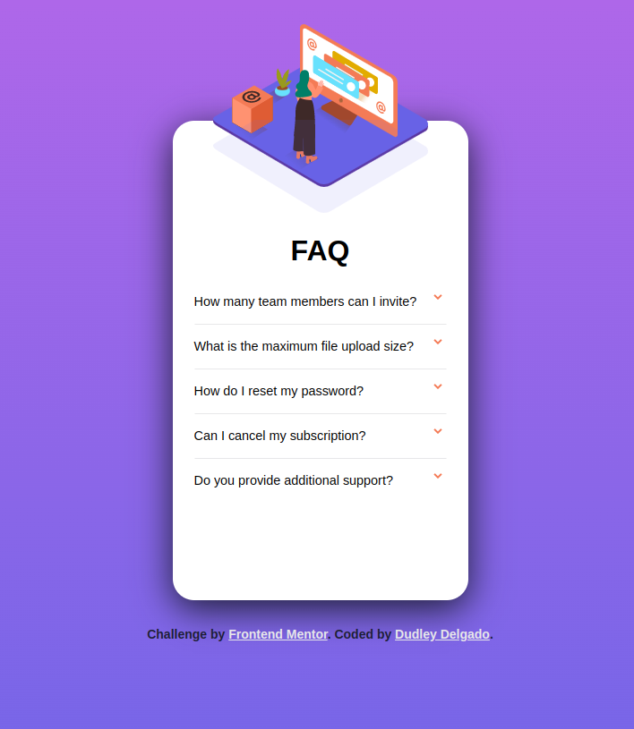
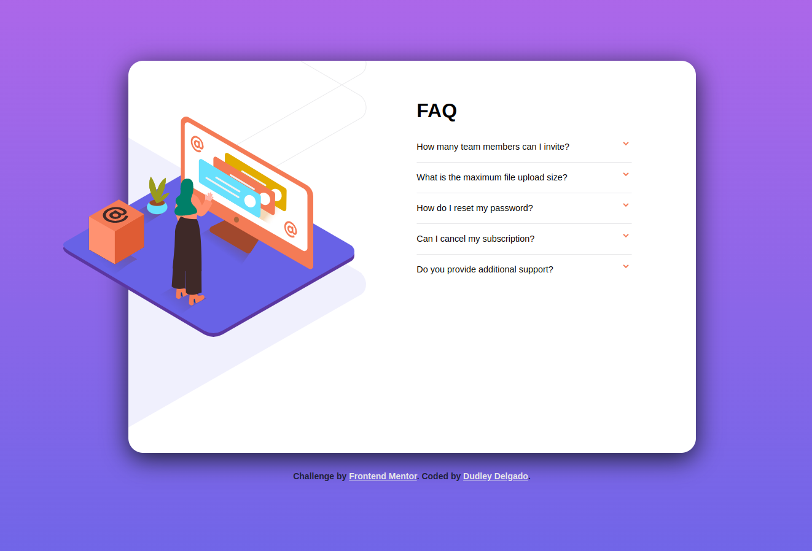

# Frontend Mentor - FAQ accordion card solution

This is a solution to the [FAQ accordion card challenge on Frontend Mentor](https://www.frontendmentor.io/challenges/faq-accordion-card-XlyjD0Oam). Frontend Mentor challenges help you improve your coding skills by building realistic projects.

## Table of contents

  - [The challenge](#the-challenge)
  - [Screenshot](#screenshot)
  - [Links](#links)
  - [My process](#my-process)
  - [Built with](#built-with)
  - [What I learned](#what-i-learned)
  - [Useful resources](#useful-resources)
  - [Author](#author)

### The challenge

Users should be able to:

- View the optimal layout for the component depending on their device's screen size
- See hover states for all interactive elements on the page
- Hide/Show the answer to a question when the question is clicked

### Screenshot





### Links

- Solution URL: [Add solution URL here](https://your-solution-url.com)
- Live Site URL: [Add live site URL here](https://your-live-site-url.com)

## My process

The most complicated part of this challenge seemed to me to be the orderly positioning of the elements such as the background of the main image.

The process that I have followed is to separate into 2 containers: left and right, and then in the desktop version using display flex, separate both containers horizontally with a media query.

By having tags like <details> and <summary> from html it was not necessary to add javascript to the project.

### Built with

- Semantic HTML5 markup
- CSS custom properties
- Flexbox
- Mobile-first workflow


### What I learned

I think what I learned the most from this challenge is that sometimes we worry about finding a way to do things with JavaScript without first analyzing whether it is feasible to do this functionality with html and css without adding more code to our project.

I believe that we should constantly be analyzing the new tags of these two languages ​​in order to make cleaner decisions for our code.

```html
<details>Accordion container</details>
<summary>Accordion summary</summary>
```
```css
.details[open] {
    transform: rotate(180deg);
    transition: 300ms;
}
```

### Useful resources

- [Example resource 1](https://developer.mozilla.org/en-US/docs/Web/HTML/Element/details) - This helped me for accordion create.

## Author

- Website - [DudleyDelgado](https://dudleydelgado.github.io/portfolio/)
- Frontend Mentor - [@dudleydelgado](https://www.frontendmentor.io/profile/yourusername)
- Instagram - [@dudley.code](https://www.instagram.com/dudley.code/)
